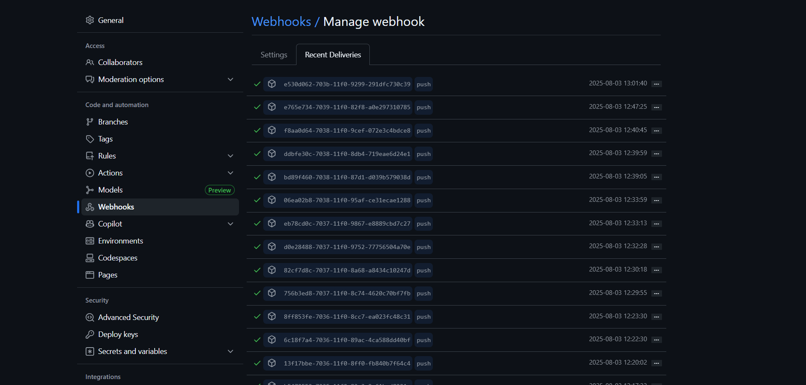
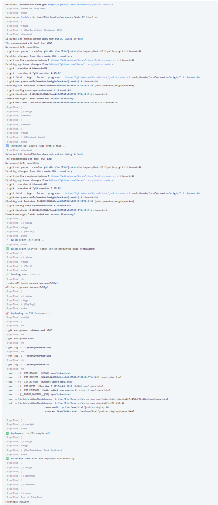
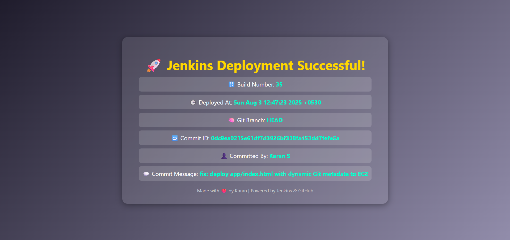

<!-- Build Status Badge from Jenkins -->
``````
<div align="center">

<!-- 🔨 Project Info -->


<br/>

<!-- 📊 Repository Stats -->


<br/>

<!-- 💬 Community & Contribution -->


</div>


<h1 align="center">🚀 Jenkins CI/CD Pipeline with GitHub & EC2 Deployment 🌐</h1>

<p align="center">
  A complete end-to-end CI/CD pipeline setup using <strong>GitHub Webhook</strong>, <strong>Jenkins</strong>, and <strong>AWS EC2</strong> that automatically builds, tests, and deploys code with every push!
</p>

<p align="center">
  
  
  
</p>

---

## 🌟 Project Overview

Welcome to my **end-to-end CI/CD DevOps project**! This project demonstrates a complete **CI/CD pipeline** using:

- 🔁 **GitHub Webhook** for triggering Jenkins on code push
- ⚙️ **Jenkins Pipeline** (Declarative) to build, test, and deploy
- ☁️ **AWS EC2** instance for deployment
- 🌐 Stylish **HTML output** showing commit details after deployment

This is a real-time deployment pipeline built from scratch, fully automated using **Jenkins Declarative Pipeline**.

---

## 🧰 Tech Stack

| Category              | Tools / Services                          |
|----------------------|-------------------------------------------|
| CI/CD Pipeline       | Jenkins 🧰                                 |
| Version Control      | Git & GitHub 🐙                            |
| Deployment Server    | AWS EC2 (Ubuntu) 💻                        |
| Auth & Security      | SSH using `.pem` key 🔐                    |
| Hosting Path         | `/var/www/html/jenkins-deploy` 🌍         |
| Frontend             | HTML, CSS 🎨                               |
| Script Language      | Shell (Bash) 🐚                            |

---

## ⚙️ Jenkins Pipeline Stages

| Stage       | Description                                 |
|-------------|---------------------------------------------|
| 🔄 Checkout | Pulls latest code from GitHub repo          |
| 🔧 Build    | Simulated build/compilation stage           |
| 🧪 Test     | Runs basic validation/unit tests            |
| 🚀 Deploy   | SSH to EC2 and deploys styled HTML page     |
| ✅ Post     | Shows success/failure & runs curl healthcheck |

---

## 📂 Project Structure

```
jenkins-node-ci/
├── Jenkinsfile
├── app/
│   └── index.html     # HTML output template with injected Git info
├── assets/
│   ├── webhook.png    # GitHub webhook configuration screenshot
│   ├── pipeline.png   # Jenkins build pipeline screenshot
│   └── output.png     # EC2 browser output screenshot
└── README.md
```

---

## 🛠️ Jenkins Pipeline Workflow

1. ✅ **Code is pushed to GitHub**
2. ✅ **GitHub Webhook triggers Jenkins Job**
3. ✅ **Build & Test pipeline stages run**
4. ✅ **HTML file is updated with Git info**
5. ✅ **HTML file is deployed to EC2 using SSH**
6. ✅ **Post-deploy health check with `curl` ensures it's live**

### ✅ Final Output

> Visit: `http://<your-ec2-ip>/jenkins-deploy/`  
> You’ll see:
```html
🚀 Jenkins Deployment Successful!
Git Metadata shown in a styled HTML page.
```

---

## 📸 Screenshots

| 🔗 GitHub Webhook settings | ⚙️ Jenkins Pipeline - console output | 🌐 EC2 Deployed Output |
|-------------------------|--------------------|------------------------|
|  |  |  |

---

## 📌 Setup Instructions

> Requirements:
> - Jenkins installed on EC2 (or local)
> - Public EC2 instance for HTML output
> - GitHub Webhook enabled (Settings > Webhooks)
> - SSH `.pem` key added in Jenkins securely

---

## 💡 Future Improvements

- 🐳 Add Docker build/push stage
- 🧪 Add JUnit test coverage reporting
- 📊 Integrate Prometheus + Grafana monitoring
- 🌐 Add multi-environment support (staging/prod)
- 📩 Slack/Mattermost integration for notifications

---

## 🙋‍♂️ Author

<p align="center">
  <strong>Karan S</strong><br>
  💼 <a href="https://linkedin.com/in/karan-devops" target="_blank">LinkedIn</a> |
  📁 <a href="https://github.com/KaranPrince" target="_blank">GitHub</a>
</p>

<p align="center">Made with ❤️ by Karan S | Jenkins + GitHub + EC2</p>
